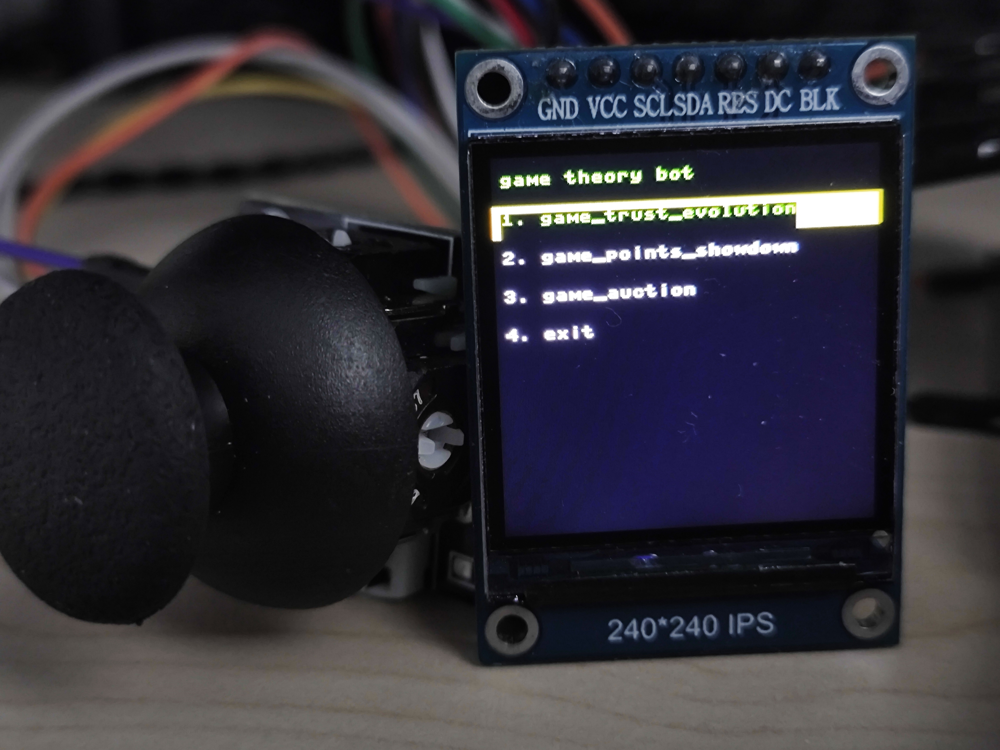

<!--
IMPORTANT: 在将此内容复制到你的 README.md 文件之前，
请务必将 `link-to-your-project-demo.gif` 替换为你的项目实际运行的 GIF 或图片链接。
这是提高项目吸引力的关键！
同时，请根据你实际选择的开源许可证，修改“许可证”部分的内容，并确保你的项目根目录有一个名为 LICENSE 的文件。
-->

# 博弈机器人

这是一个基于 MicroPython 的手持游戏机项目，运行在带有 ST7789 彩色屏幕和摇杆的 ESP32 开发板上。它内置了三款基于博弈论和 AI 学习的策略游戏。




## 目录
* [项目简介](#项目简介)
* [主要特性](#主要特性)
* [包含的游戏](#包含的游戏)
* [硬件需求](#硬件需求)
* [软件与安装](#软件与安装)
* [项目结构](#项目结构)
* [如何使用](#如何使用)
* [贡献](#贡献)
* [作者](#作者)
* [许可证](#许可证)

## 项目简介
本项目旨在打造一个便携的、开源的策略游戏平台。通过模块化的设计，项目将硬件驱动、UI管理、游戏逻辑完全分离，使得扩展新游戏或更换硬件变得更加容易。核心程序 `main.py` 作为一个状态机，负责协调硬件初始化、主菜单导航以及各个子游戏的启动与退出。

## 主要特性
*   **模块化架构**: 清晰分离的硬件驱动、UI管理器和游戏逻辑。
*   **状态机驱动**: 使用主循环中的状态机来管理整个程序的流程，清晰高效。
*   **硬件抽象层**: `display_driver` 和 `joystick_driver` 将底层硬件操作封装起来，方便上层调用。
*   **通用UI管理器**: `ui_manager` 提供了绘制菜单、消息框、文本等常用UI元素的功能。
*   **AI 对手**: 内置的游戏包含使用 Q-Learning 算法的 AI 对手，能够根据玩家的行为进行学习和适应。
*   **易于配置**: 所有硬件引脚配置集中在 `main.py` 的开头，方便根据实际接线进行修改。

## 包含的游戏

### 信任的进化 (Trust & Evolution)
*   **类型**: 博弈论，基于经典的“囚徒困境”。
*   **玩法**: 在多轮游戏中，玩家选择“信任”（合作）或“进化”（背叛）一个 AI 对手。AI 会使用 Q-Learning 算法学习你的策略，并尝试获得最高分。
*   **目标**: 探索不同策略下的得分情况，并观察 AI 的行为演变。

### 点数对决 (Points Showdown)
*   **类型**: 策略性竞价游戏。
*   **玩法**: 玩家和 AI 各有一定初始点数。在每轮中，双方秘密下注一定点数，出价高者赢得该轮。AI 使用 Q-Learning 算法，根据剩余点数、剩余回合等状态来决定最佳下注策略。
*   **目标**: 在所有回合结束后，赢得比 AI 更多的回合。

### 拍卖游戏 (Auction Game)
*   **类型**: 模拟经营，多人（1个玩家 vs 2个AI）拍卖。
*   **玩法**: 每个参与者会随机分到一些物品和初始资金。每轮由一个玩家拿出自己的物品进行拍卖，其他玩家（包括AI）进行竞价。
*   **目标**: 通过买卖物品，在游戏结束时拥有最高的总资产（现金+物品价值）。

## 硬件需求

| 组件       | 描述                                     |
|------------|------------------------------------------|
| 微控制器   | 推荐 ESP32 / ESP32-S3 (代码中使用了其 `machine` 库)。 |
| 显示屏     | 240x320 分辨率的 ST7789 TFT LCD 彩色屏幕。      |
| 输入设备   | 5向摇杆模块 (X/Y轴为模拟量, Z轴为按钮)。       |
| 连接线     | 杜邦线若干。                             |

## 软件与安装

1.  **刷入 MicroPython 固件**
    首先，你需要为你的 ESP32 开发板刷入最新的 MicroPython 固件。

2.  **安装 IDE**
    推荐使用 [Thonny IDE](https://thonny.org/)，它对 MicroPython 提供了良好的支持，可以方便地连接设备和上传文件。

3.  **上传文件**
    将本项目中的所有 `.py` 文件上传到你的 ESP32 开发板的根目录。请确保文件名与 `main.py` 中的 `import` 语句完全一致。
    *   `main.py`
    *   `ui_manager.py`
    *   `joystick_driver.py`
    *   `display_driver.py` (包含 ST7789 类的文件)
    *   `game_trust_evolution.py`
    *   `game_points_showdown.py`
    *   `game_auction.py`

4.  **配置硬件引脚**
    这是最重要的一步！ 打开 `main.py` 文件，找到开头的硬件配置部分。根据你自己的硬件接线，修改以下引脚编号：

    ```python
    # --- 硬件配置占位符 (根据实际接线填写) ---
    # SPI 总线配置
    SPI_BUS_ID = 1
    SPI_BAUDRATE = 40000000
    SPI_SCK_PIN_NUM = 12    # <--- 修改这里
    SPI_MOSI_PIN_NUM = 11   # <--- 修改这里

    # ST7789 屏幕控制引脚
    ST7789_DC_PIN_NUM = 2    # <--- 修改这里
    ST7789_RST_PIN_NUM = 5   # <--- 修改这里
    ST7789_BL_PIN_NUM = 13   # <--- 修改这里 (如果你的屏幕没有背光引脚，设为 None)

    # Joystick 引脚配置
    JOYSTICK_X_PIN_NUM = 16     # <--- 修改这里
    JOYSTICK_Y_PIN_NUM = 17     # <--- 修改这里
    JOYSTICK_BTN_PIN_NUM = 18   # <--- 修改这里
    ```

5.  **运行**
    保存所有修改后，在 Thonny 中按下 Ctrl+D 重启 ESP32，`main.py` 应该会自动运行。你也可以在 REPL 中手动运行：

    ```python
    import main
    ```

## 项目结构

    ├── main.py # 主程序入口，状态机，硬件初始化和全局协调
    ├── display_driver.py # ST7789 屏幕的底层驱动
    ├── joystick_driver.py # 摇杆的底层驱动，处理ADC读数和按键事件
    ├── ui_manager.py # 高级UI接口，用于绘制菜单、消息框等
    ├── game_trust_evolution.py # “信任的进化”游戏逻辑
    ├── game_points_showdown.py # “点数对决”游戏逻辑
    └── game_auction.py # “拍卖游戏”游戏逻辑


## 如何使用
*   **开机**: 连接电源，设备将自动初始化并显示欢迎界面。
*   **主菜单**: 欢迎界面后会进入主菜单，列出了所有可玩的游戏。
*   **导航**:
    *   **上/下拨动摇杆**: 在菜单中上下移动光标。
    *   **按下摇杆**: 确认选择，进入选中的游戏或选项。
*   **游戏内操作**: 进入游戏后，请根据屏幕上的提示进行操作。通常摇杆用于选择，按键用于确认。
*   **退出游戏**: 每个游戏结束后，都会有提示引导你按键返回主菜单。

## 贡献
我们欢迎任何形式的贡献！如果你有好的想法、发现了Bug或者想添加新游戏，请遵循以下步骤：
1.  Fork 本项目。
2.  创建你的功能分支 (`git checkout -b feature/AmazingFeature`)。
3.  提交你的更改 (`git commit -m 'Add some AmazingFeature'`)。
4.  推送到分支 (`git push origin feature/AmazingFeature`)。
5.  打开一个 Pull Request。

## 作者
*   [Xiyan Liao](https://github.com/ShiaLiao) - game_trust_evolution 游戏代码；主程序main和ui管理代码，软件层级设计
*   [Weiran Cui](https://github.com/cwr111) - game_points_showdown游戏代码；摇杆控制输入代码；总代码测试与bug修复
*   [Xiangyi Wei] - game_auction游戏代码，st7789的驱动，绘制电路原理图

## 许可证
这个项目采用 [MIT 许可证](LICENSE) - 详见 [LICENSE](LICENSE) 文件了解更多细节。
<!-- 👆 请根据你实际选择的许可证类型修改这里，并确保你的项目根目录有一个名为 LICENSE 的文件。 -->
<!-- 常见的开源许可证有 MIT, Apache 2.0, GPLv3 等。 -->